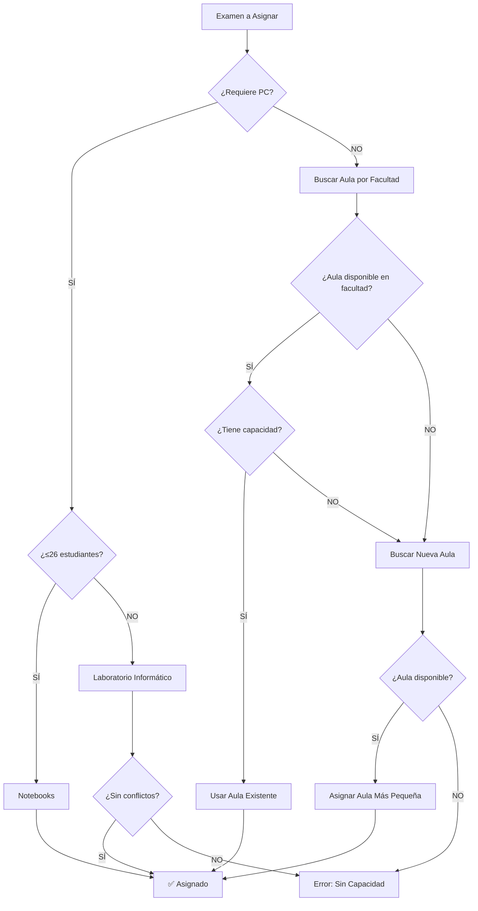

# 🎯 SISTEMA DE ASIGNACIÓN AUTOMÁTICA DE AULAS

## 📋 **Descripción del Sistema**

El sistema de asignación automática de aulas para el TOTEM utiliza criterios inteligentes para asignar espacios físicos y virtuales según las necesidades específicas de cada examen.

---

## 🏢 **Aulas Disponibles**

Según la configuración del sistema UAM 03:

| Aula | Capacidad | Tipo | Uso |
|------|-----------|------|-----|
| **Notebooks** | 26 | Virtual | Exámenes informáticos ≤26 estudiantes |
| **Laboratorio Informático** | 34 | Laboratorio | Exámenes informáticos >26 estudiantes |
| **Aula 4** | 72 | Física | Exámenes regulares |
| **Aula 8** | 71 | Física | Exámenes regulares |
| **Aula 12** | 69 | Física | Exámenes regulares |

**Capacidad total**: 272 estudiantes

---

## 🧮 **Criterios de Asignación**

### **1. 🖥️ EXÁMENES INFORMÁTICOS**

**Condición**: `requierePc = true` O `modalidadExamen = 'INFORMATICO'`

- **≤ 26 estudiantes** → **Notebooks** (virtual)
  - No requiere aula física
  - 26 notebooks portátiles disponibles
  
- **> 26 estudiantes** → **Laboratorio Informático**
  - Capacidad: 34 PCs de escritorio
  - Verificación de conflictos de horario

### **2. 🏢 EXÁMENES REGULARES**

**Condición**: `requierePc = false` (por defecto)

#### **Criterio Principal: Agrupación por Facultad**
1. **Buscar aula ya asignada** a la misma facultad en la misma fecha
2. **Verificar capacidad disponible** en esa aula
3. **Si no hay capacidad**, asignar nueva aula

#### **Priorización de Aulas**
- **Prioridad 1**: Aula más pequeña que cubra la necesidad
- **Orden**: Aula 12 (69) → Aula 8 (71) → Aula 4 (72)

---

## 🔧 **Endpoints Disponibles**

### **1. Asignación Individual**
```http
POST /api/v1/examenes/{id}/asignar-automatico
```

**Ejemplo de respuesta:**
```json
{
  "success": true,
  "data": {
    "id": 123,
    "nombreMateria": "Matemática I",
    "aula": {
      "nombre": "Aula 12",
      "capacidad": 69
    }
  },
  "criterio": "POR_FACULTAD",
  "detalles": {
    "cantidadEstudiantes": 35,
    "capacidadAula": 69,
    "espaciosLibres": 34
  }
}
```

### **2. Asignación Masiva**
```http
POST /api/v1/examenes/asignacion-masiva
```

**Parámetros:**
```json
{
  "examenesIds": [123, 124, 125], // Opcional: IDs específicos
  "soloSinAula": true // Por defecto: procesar solo exámenes sin aula
}
```

### **3. Configurar Examen**
```http
PUT /api/v1/examenes/{id}/configurar
```

**Parámetros:**
```json
{
  "modalidadExamen": "INFORMATICO", // INFORMATICO, REGULAR
  "requierePc": true, // true, false
  "asignacionAuto": true, // true, false
  "criterioAsignacion": "INFORMATICO" // INFORMATICO, POR_FACULTAD, MANUAL
}
```

---

## 🎮 **Ejemplos de Uso**

### **Ejemplo 1: Configurar Examen Informático**
```bash
# 1. Configurar como examen informático
curl -X PUT http://localhost:3000/api/v1/examenes/123/configurar \
  -H "Content-Type: application/json" \
  -d '{
    "modalidadExamen": "INFORMATICO",
    "requierePc": true,
    "asignacionAuto": true
  }'

# 2. Asignar automáticamente
curl -X POST http://localhost:3000/api/v1/examenes/123/asignar-automatico
```

### **Ejemplo 2: Asignación Masiva**
```bash
# Asignar aulas a todos los exámenes sin aula
curl -X POST http://localhost:3000/api/v1/examenes/asignacion-masiva \
  -H "Content-Type: application/json" \
  -d '{"soloSinAula": true}'
```

### **Ejemplo 3: Asignación Manual con Override**
```bash
# Desactivar asignación automática
curl -X PUT http://localhost:3000/api/v1/examenes/123/configurar \
  -H "Content-Type: application/json" \
  -d '{
    "asignacionAuto": false
  }'

# Asignar manualmente
curl -X PUT http://localhost:3000/api/v1/examenes/123/asignar-aula \
  -H "Content-Type: application/json" \
  -d '{"aulaId": 5}'
```

---

## 🔍 **Validaciones Automáticas**

### **✅ Verificaciones que Realiza el Sistema**

1. **Conflictos de Horario**
   - Misma aula, fecha y hora
   - Excepción: Notebooks (virtual, sin límite temporal)

2. **Capacidad Suficiente**
   - Estudiantes inscriptos ≤ Capacidad del aula
   - Consideración de exámenes simultáneos

3. **Compatibilidad de Modalidad**
   - Exámenes informáticos → Aulas informáticas
   - Exámenes regulares → Aulas físicas

4. **Disponibilidad de Aula**
   - Aula marcada como `disponible = true`

### **⚠️ Manejo de Conflictos**

**Si no se puede asignar automáticamente:**
- **Retorna error descriptivo**
- **Mantiene configuración actual**
- **Sugiere alternativas cuando es posible**

---

## 📊 **Algoritmo de Asignación**



---

## 🎯 **Configuración por Defecto**

Al crear exámenes nuevos:
- `asignacionAuto = true`
- `requierePc = false`
- `modalidadExamen = null`
- `criterioAsignacion = null`

---

## 🔧 **Comandos de Configuración**

### **Configurar Aulas Iniciales**
```bash
node scripts/configurar-aulas-iniciales.js
```

### **Verificar Estado del Sistema**
```bash
curl http://localhost:3000/api/v1/dashboard/resumen
```

---

## 💡 **Mejores Prácticas**

1. **Configurar modalidad ANTES de asignar aula**
2. **Usar asignación masiva para optimizar distribución**
3. **Revisar conflictos antes de confirmar horarios**
4. **Mantener capacidades actualizadas**

---

## 🚀 **Ejemplo de Flujo Completo**

```bash
# 1. Sincronizar cronogramas
curl -X POST http://localhost:3000/api/v1/totem/sync

# 2. Configurar exámenes informáticos
curl -X PUT http://localhost:3000/api/v1/examenes/123/configurar \
  -d '{"requierePc": true}'

# 3. Asignación masiva automática
curl -X POST http://localhost:3000/api/v1/examenes/asignacion-masiva

# 4. Verificar resultado
curl http://localhost:3000/api/v1/dashboard/resumen
```

---

## 📈 **Estadísticas del Sistema**

El sistema proporciona:
- **Total de exámenes procesados**
- **Porcentaje de asignación exitosa**
- **Distribución por facultad**
- **Uso de aulas por tipo**
- **Alertas de conflictos**

---

> 💡 **Nota**: Este sistema está diseñado para ser **flexible y modificable**. Se puede ajustar la lógica de asignación según las necesidades específicas de la institución. 